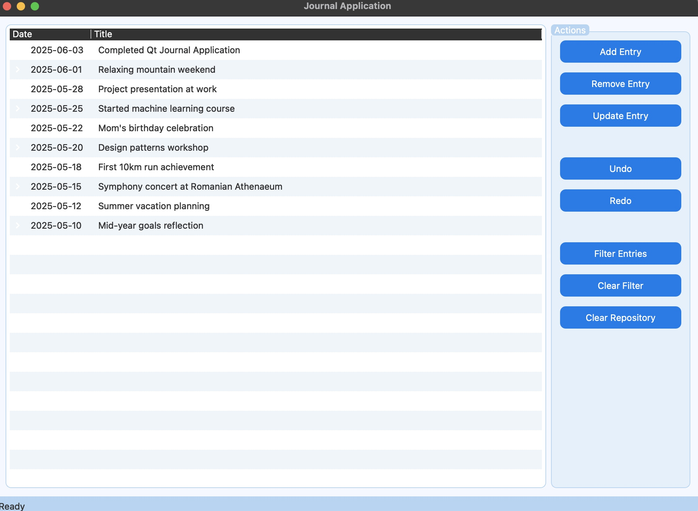

# Digital Journal Application 📔

A modern desktop application for managing a personal journal, built in **C++** using the **Qt framework**. This project was developed as a final assignment for the Object-Oriented Programming course, demonstrating clean architecture, design patterns, and efficient memory management.

---

## ✨ Features

- **Complete CRUD Operations** – Add, modify, and delete journal entries
- **Advanced Filtering** – Filter entries by custom criteria, supporting logical combinations (AND/OR)
- **Undo/Redo** – Safely revert or reapply actions without data loss, implemented using the Command pattern
- **Data Persistence** – Save and load the journal in **CSV** and **JSON** formats (using Qt JSON: `QJsonDocument`, `QJsonObject`)
- **User-Friendly Interface** – Built with Qt Widgets and Layouts, easy to navigate and use

---

## 🏗️ Architecture

The application follows a **three-layer architecture**, clearly separating responsibilities:

1. **Presentation (UI)** – Graphical interface built with Qt Widgets (forms, tables, buttons)
2. **Business Logic (Controller)** – Handles validation, user commands, and coordination between UI and data
3. **Data (Repository)** – Abstraction for storage, with concrete implementations for CSV and JSON

---

## 🛠️ Design Patterns Used

| Pattern | Purpose |
|--------|---------|
| **Command Pattern** | Implements Undo/Redo by encapsulating actions into commands (AddCommand, RemoveCommand, UpdateCommand) |
| **Strategy / Specification Pattern** | Provides flexible and extensible filtering of entries, allowing logical combination of criteria |
| **Repository Pattern** | Separates data access logic from the rest of the application |
| **RAII** | Automatic resource management (memory, files) |

---

## 🧠 Memory Management

- **Zero memory leaks** – Ensured memory safety and robust resource management without relying on external garbage collection.
- **RAII** – All resources are managed automatically via constructors/destructors
- **Smart pointers** – Extensive use of `std::unique_ptr` and `std::shared_ptr` for safe dynamic memory allocation

---

## 🧪 Testing

Core functionalities are covered by **automated tests**:
- CRUD operations in the repository
- Filtering logic
- Undo/Redo mechanism

---

## 🚀 Technologies Used

- **Language:** C++17
- **Framework:** Qt 6.9.0 (Widgets, Core, JSON)
- **Build system:** CMake
- **Version control:** Git

---

## 📦 Installation & Running

### Prerequisites
- Qt 6.x installed (recommended 6.9.0)
- CMake 3.16+

### Steps

```bash
# Clone the repository
git clone https://github.com/Daricel/digital-journal-qt.git
cd digital-journal-qt

# Create a build directory
mkdir build && cd build

# Configure the project (adjust Qt path if necessary)
cmake .. -DCMAKE_PREFIX_PATH=~/Qt/6.9.0/macos

# Compile
make -j$(sysctl -n hw.ncpu)   # on macOS
# or make -j$(nproc) on Linux

# Run the application
./journal_test

```
Alternatively, you can open the project directly in Qt Creator:

File → Open File or Project → select CMakeLists.txt

Choose the appropriate kit (e.g., "Desktop Qt 6.9.0")

Click the Run button

---
## 📸 Screenshot


## 📄 License

- This project is intended for educational purposes and can be used as a reference for learning three‑layer architecture and design patterns in C++/Qt.
---
Made with ❤️ for the OOP lab
- Babeș-Bolyai University, Faculty of Mathematics and Computer Science